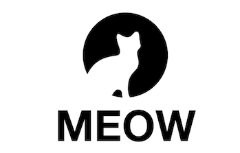

    

    
    
    

## Meow

面向新手的 Git/GitHub/GitLab 团队协作修炼场所

### 目标

* 为使用 Git/GitHub/GitLab 协作的团队中的新手成员提供一份参考指南和训练场所。
* 项目本身很简单，不要求参与的人贡献代码，不需要编程技能，任何想熟悉 Git/GitHub/Gitlab 的人都可以参加。
* 通过这个项目可以学会:
    * Git 从克隆项目(fork/clone), 创建分支(branch)，提交和同步修改(pull/push)，到发起合并请求(PR)的流程;
    * 使用 GitHub/GitLab 进行项目协作开发管理。

### 分支说明

#### 长期分支(稳定分支)

* master

#### 临时分支

* issues/{issue-id}，新建分支优先使用的命名约定 
* bugfix/{issue-id}，为了区分描述的问题是BUG，可以使用 bugfix 分支命名约定
* hotfix/{issue-id}，紧急情况的线上修复，可以使用 hotfix 分支命名约定
* releases/{milestone-title}，项目定期发布的分支命名约定

#### Git 分支规范

0. fork 项目到自己的空间，如果是自己是 GitLab 的项目成员或者 GitHub 的项目协作成员，可以不用做这一步
1. 认领自己准备要做的 issue,  假设 issue 编号是 #99
2. 更新自己本地 master 分支代码: `git pull`
3. 创建一个名字叫 issues/99 的分支: `git checkout -b issues/99 master`
4. 开始功能开发，每一个 commit 都要带上自己的 issue id，完成之后提交自己的改动，如 `git commit -m '#99 昨天撸的那只猫的照片'`
5. 提交自己的分支到 GitLab 或者 GitHub 上，`git push -u origin issues/99`
6. 如果自己的分支开发完毕，本地测试过了，向 milestone 对应的分支发起 pull request(PR), 假设 milestone 名字是 20181028, base 分支则是 releases/20181028
7. 等 milestone 中所有的 issue 的开发都完成了(开发不完则移动到下一个 milestone)，则都合并到 releases/20181028, 这样 releases/20181028 这个分支就是最新开发的所有功能的代码，master 是上一个最新的，后面我们流程规范了，还会对 releases/20181028 分支进行各种测试，这个分支没有问题了
8. 将 releases/20181028 分支与 master 分支合并, 打个 tag，名字是 20181028, `git tag 20181028`，进行发布
9. 进入下一个迭代和功能开发

### 项目管理

使用 Label 和 Issue 进行项目管理

#### 标签分组和颜色设置

| 分组   | 前缀 |      Label      |  背景颜色 RGB 值 |
|----------|----|:-------------|------|
| 项目排期 | 项目: | 已确认，已排期，延后，开发中，测试中，已上线，待讨论 | c5def5 |
| 功能分类 | 分类: | BUG，新功能，功能增强，功能完善，文档修改    |   d4c5f9 |
| 优先级 | 优先级: | 紧急，高，低 |  e99695 |

### 参考资料

* [AMP](https://github.com/ampproject/amphtml/labels)
* [MIP](https://github.com/mipengine/mip/labels)
* [Dress](https://github.com/komeiji-satori/Dress)

### License

本项目采用知识共享署名-非商业性使用-相同方式共享 4.0 国际许可协议进行许可。
